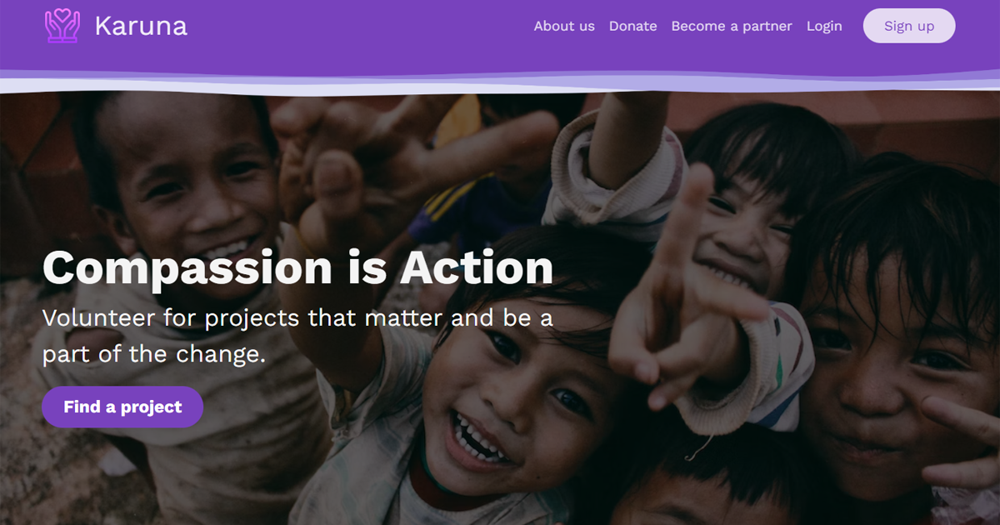

# Karuna

<!---Esses são exemplos. Veja https://shields.io para outras pessoas ou para personalizar este conjunto de escudos. Você pode querer incluir dependências, status do projeto e informações de licença aqui--->

> Volunteering Platform and Social Network to connect NGOs and volunteers around the world. Developed in 8 days by a team of 4 for the final project for Le Wagon coding bootcamp. Built using Ruby on Rails, JavaScript with StimulusJS, CSS and Bootstrap.

## ⚙️ Tools & Technologies used

 
  
  
  
  
  
  
  
  
  
  
  
  
  
  </a>

 

#

## 💻 Development Team

<table>
  <tr>
    <td align="center">
      <a href="https://github.com/felipecrubio">
         
        
          <a href="https://github.com/felipecrubio"><b>Felipe Rubio</b></a>
        
      </a>
    </td>
    <td align="center">
      <a href="https://github.com/apcbrasil">
         
        
          <a href="https://github.com/apcbrasil"><b>Ana Paula Brasil</b></a>
        
      </a>
    </td>
    <td align="center">
      <a href="https://github.com/zimer69">
         
        
          <a href="https://github.com/zimer69"><b>Dimitri Zimermann</b></a>
        
      </a>
    </td>
    <td align="center">
      <a href="https://github.com/Joana3991">
         
        
          <a href="https://github.com/Joana3991"><b>Joana Arêas</b></a>
        
      </a>
    </td>
  </tr>
</table>

##

### Upcoming Features

- [ ] Add achievements feature for Volunteers
- [ ] Add geocoding for map display on search functionality
- [ ] Add skill tags for Volunteers and skill requirements for Projects
- [ ] Update request acceptance functionality

##

Live link: https://karuna-world.herokuapp.com/

##

[⬆ Back to the top](#karuna) 

